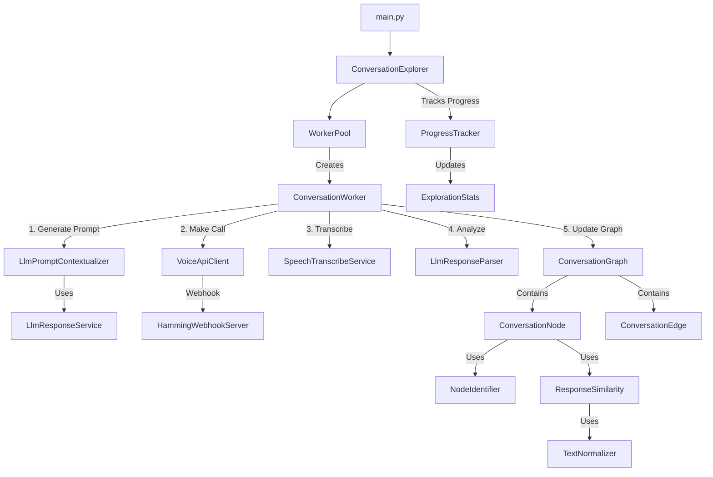

# System Architecture



# Get Running
Start both the frontend and backend services in both of respective directories using docker:
```
docker-compose up --build
```

Go to `localhost:5000` to view the graph being built in real-time. Just for simplicity the frontend polls the
backend every minute to get the latest nodes/edges, in a real-world scenario this would be done using websockets.